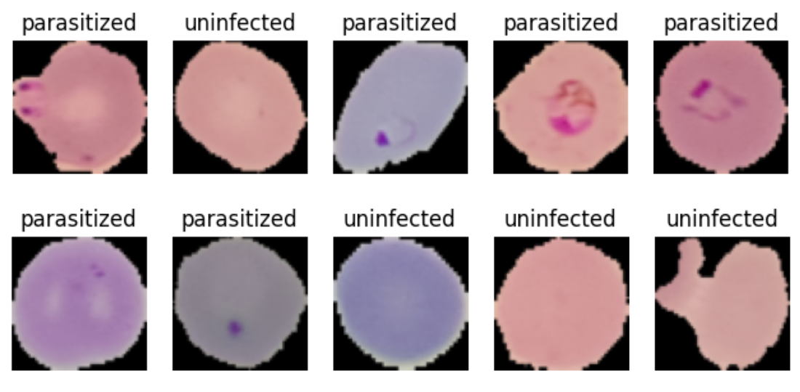
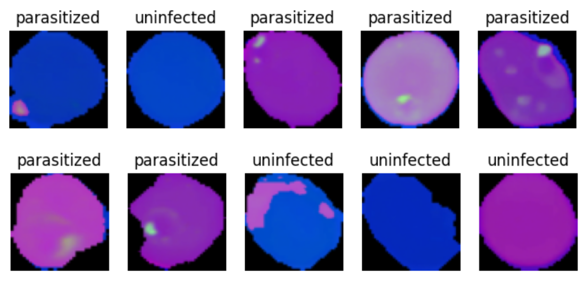

# Malaria Detection using Deep Neural Networks

### Problem Definition

Malaria caused by Plasmodium falciparum is a life-threatening disease that continues to be a global concern. It is prevalent in numerous subtropical countries with limited health-monitoring systems. According to the World Health Organization, each year, hundreds of millions of individuals are affected by this disease [1]. In 2021, there were approximately 247 million reported malaria cases and an estimated 619,000 deaths. The disease is transmitted through the bites of female Anopheles mosquitoes, primarily between dusk and dawn. Global efforts are concentrated on prevention by developing vaccines and controlling mosquito populations, as well as on creating early, diverse, and reliable diagnostic tools, new treatment options, and eradication strategies.

Several methods are used for malaria detection, including rapid diagnostic tests [2], clinical diagnosis, polymerase chain reaction [3], and microscopic diagnosis. The traditional method involves trained technicians visually examining blood smears under a microscope to identify parasite-infected red blood cells. However, this process is inefficient, and the diagnostic accuracy depends on the skill of the person conducting the test. To enhance reliability and consistency, automatic image recognition systems based on machine learning have been developed to clasify malaria blood smears. Nevertheless, the practical performance has been insufficient so far [4].

References:
[1] World malaria report 2022. Available online: https://www.who.int/teams/global-malaria-programme/reports/world-malaria-report-2022 (accessed on 26 March 2023).
[2] Azikiwe, C.C.; Ifezulike, C.C.; Siminialayi, I.M.; Amazu, L.U.; Enye, J.C.; Nwakwunite, O.E. A comparative laboratory diagnosis of malaria: Microscopy versus rapid diagnostic test kits. Asian Pac. J. Trop Biomed. 2021, 2, 307–310.
[3] Mirahmadi, H.; Rahmati-Balaghaleh, M.; Afzalaghaee, M.; .Zarean, M.; Shamsian, S.A.; Mehravaran, A.; Raissi, V.; Etemadi, S. Detection of malaria using blood smear by light microscopy, RDT and nested-PCR for suspected patients in south-eastern Iran. Gene Re 2021, 25, 101339.
[4] Hemachandran, K.; Alasiry, A.; Marzougui, M.; Ganie, S.M.; Pise, A.A.; Alouane, M.T.-H.; Chola, C. Performance Analysis of Deep Learning Algorithms in Diagnosis of Malaria Disease. Diagnostics 2023, 13, 534.

### Objectives:

Perform an analysis of deep learning algorithms in the diagnosis of malaria from microscopic images to identify the best approach that improves reliability, accuracy and replicability of the diagnostic process.
Propose a low-cost and widely accessible integration of the selected model into a point-of-care network.

My personal objective is to use PyTorch library that I have never worked with before, with a help of tutorials [5, 6].

References:
[5] LearnPyTorch - Custom Datasets. Available online: https://www.learnpytorch.io/04_pytorch_custom_datasets/#04-pytorch-custom-datasets (accessed on 26 March 2023 - 30 March 2023).
[6] LearnPyTorch - Computer Vision. Available online: https://www.learnpytorch.io/03_pytorch_computer_vision/#03-pytorch-computer-vision (accessed on 26 March 2023 - 30 March 2023).

### Key Questions

Can we use deep learning algorithms to improve the microscopic diagnostic process of malaria?

Which deep learning algorithm is most suitable for the problem?

Which deep learning technique best solves the problem?
 - Which classification metric is the most relevant for selecting the best deep learning model?
 - Does data augmentation improve the model's performance?
 - What are the low-cost and widely accessible means of implementing the selected model into the point-of-care workflow?

### The problem formulation:

 - Malaria is a life-threatening disease affecting mostly subtropical nations with little health-monitoring infrastructure.
 - Current microscopic techniques for diagnosing malaria are inefficient and highly dependent on human expertise level.
 - Early, accurate, repricable and widely accessible diagnosis of malaria could help decrease the mortality rate of the disease.
 
 ### Results
 
The final proposed solution is a CNN [4] improved with LeakyReLU to combat vanishing gradients and Batch Normalization to reduce the internal covariate shift and make training more stable and efficient, utilizing HSV-transformed images. HSV transformation was chosen due to its robustness to lighting variations and shadows, as the Hue component remains relatively stable under different microscopic lighting conditions, resulting into a clear color definition of parasites within red blood cells and helping to differentiate them from cell impurities (thus improving false positivity rates).

RGB images.

HSV images.
 
 # Data
 
This dataset was taken from the National Institutes of Health (NIH) website (https://www.nih.gov/, accessed on 11 August 2022) and contains 27,558 photos, including 13,780 parasitized cell images and 13,778 uninfected cell images.
 
 # Environment
 
 Activate with `conda env create -f malaria_detection.yml`.
 
 
